# LexiFlow 后端项目结构与架构文档

更新时间：2026-07-03

代码根目录：`lexiflow-backend`

本文按“第 0 层到第 4 层”的方式，从依赖技术栈、整体架构、模块拆分、类与方法、复杂流程五个层次梳理后端项目。

## 第 0 层：依赖与技术栈

### 0.1 项目定位

LexiFlow 后端是一个基于 Spring Boot 的背单词学习系统，核心能力包括用户认证、词库管理、学习计划、每日任务、间隔重复复习、错词收藏、AI 单词问答、AI 完形填空、AI 学习报告、后台管理和系统配置。

当前工程是单体模块化后端，包名根路径为 `com.lexiflow`。工程内部按业务域拆分包，而不是拆成多个 Maven 子模块。

### 0.2 Maven 与运行时基础

| 项 | 当前实现 |
| --- | --- |
| Java 版本 | Java 17 |
| Spring Boot | 3.3.5 |
| 构建工具 | Maven |
| 当前 Artifact | `lexiflow-backend` |
| 当前版本 | `0.0.2-SNAPSHOT`，以 `pom.xml` 为准 |
| 默认端口 | 8080 |
| 默认 Profile | `local` |
| 主启动类 | `com.lexiflow.LexiflowBackendApplication` |

### 0.3 技术栈总览

| 技术层 | 技术栈 | 在项目中的作用 | 对应功能 |
| --- | --- | --- | --- |
| 运行语言 | Java 17 | 后端主开发语言，提供现代 Java 语法、时间 API、记录类型等能力 | 全部后端功能 |
| 应用框架 | Spring Boot 3.3.5 | 应用启动、自动配置、Web 容器、配置管理、Bean 生命周期 | REST API、业务服务、配置装配 |
| Web 层 | Spring MVC、Jakarta Validation | HTTP 路由、参数绑定、请求校验、JSON 序列化 | Controller 接口、DTO 校验 |
| 安全层 | Spring Security、JJWT、BCrypt | 认证过滤链、JWT 签发解析、角色授权、密码哈希 | 注册登录、Token 刷新、后台权限 |
| 数据访问层 | MyBatis-Plus、Mapper XML | ORM、分页、逻辑删除、乐观锁、复杂 SQL 查询 | 用户、词库、学习、AI、报告等数据读写 |
| 数据库 | MySQL 8、utf8mb4 | 主业务数据持久化，承载 28 张核心业务表 | 用户、词库、学习进度、AI 内容、报告 |
| 缓存与状态 | Redis、Spring Data Redis | 缓存、登录验证码、JWT 撤销、刷新会话、限流、分布式锁、AI 配额和命中缓冲 | 鉴权、AI 缓存、异步并发控制 |
| 异步消息 | RabbitMQ、Spring AMQP | 耗时任务削峰、异步执行、死信队列 | 词库导入、AI 问答、完形生成、完形评阅、报告生成 |
| AI 调用 | Spring AI OpenAI、OpenAI 兼容 Chat Completions | 统一调用公共或私有模型，支持 JSON 输出和流式输出 | 单词问答、完形、评阅、学习报告 |
| API 文档 | Knife4j、OpenAPI 3 | 接口文档、调试入口 | 前后端联调、接口说明 |
| 文件处理 | Apache POI | Excel 模板生成、词库导入、错误报告导出 | 后台词库导入 |
| 任务调度 | Spring Scheduling | 定时刷新缓冲数据 | AI 缓存命中次数回刷 |
| 运维观测 | Spring Boot Actuator、统一日志 | 健康检查、基础运行状态 | 部署探活、服务诊断 |
| 公共工程能力 | Lombok、统一异常处理、统一响应 | 减少样板代码，统一 API 返回和错误处理 | 全部接口 |

从功能上看，这个项目的技术栈不是平均分布的：普通 CRUD 功能主要依赖 Spring MVC + MyBatis-Plus + MySQL；认证和权限强依赖 Spring Security + JWT + Redis；AI 相关功能同时依赖 Spring AI、Redis 分布式锁、RabbitMQ 异步任务、MySQL 缓存表和调用日志。

### 0.4 核心依赖

| 依赖 | 用途 |
| --- | --- |
| `spring-boot-starter-web` | REST API、MVC Controller、Servlet 运行环境 |
| `spring-boot-starter-validation` | 请求 DTO 参数校验 |
| `spring-boot-starter-security` | 认证、授权、过滤器链、密码安全 |
| `spring-boot-starter-data-redis` | Redis 缓存、验证码、Token 撤销、限流、分布式锁、配额计数 |
| `spring-boot-starter-amqp` | RabbitMQ 异步任务投递与消费 |
| `spring-boot-starter-actuator` | 健康检查和运行状态暴露 |
| `mybatis-plus-spring-boot3-starter` | ORM、Mapper、分页插件、逻辑删除、乐观锁 |
| `mysql-connector-j` | MySQL 8 驱动 |
| `spring-ai-openai-spring-boot-starter` | OpenAI 兼容 Chat Completions 调用 |
| `reactor-netty-http` | Spring AI/HTTP 客户端相关运行依赖 |
| `knife4j-openapi3-jakarta-spring-boot-starter` | Knife4j/OpenAPI 文档 |
| `jjwt-api`、`jjwt-impl`、`jjwt-jackson` | JWT 生成与解析 |
| `apache-poi`、`poi-ooxml` | Excel 词库导入模板、错误报告导出 |
| `lombok` | 样板代码简化 |
| `spring-boot-starter-test`、`spring-security-test` | 测试支持 |

### 0.5 外部基础设施

| 组件 | 作用 | 本地配置 |
| --- | --- | --- |
| MySQL 8 | 主业务数据库，库名 `lexiflow` | `localhost:3306/lexiflow`，用户名 `root`，密码 `root` |
| Redis | 缓存、会话状态、JWT 撤销、验证码、限流、锁、AI 配额 | `localhost:6379`，密码 `root` |
| RabbitMQ | 词库导入、AI 完形、AI 单词问答、AI 评阅、报告生成异步队列 | `localhost:5672`，默认 `guest/guest` |
| OpenAI 兼容模型服务 | AI 单词问答、完形生成、完形评阅、学习报告 | 通过公共配置或用户私有配置决定 |

### 0.6 全局工程配置

| 配置项 | 说明 |
| --- | --- |
| `@ConfigurationPropertiesScan` | 扫描 `JwtProperties`、`CorsProperties`、`AuthCookieProperties`、`CryptoProperties` 等配置类 |
| `@MapperScan("com.lexiflow.**.mapper")` | 扫描全部业务 Mapper |
| `@EnableScheduling` | 启用定时任务，当前用于 AI 缓存命中计数刷新等 |
| MyBatis-Plus Mapper XML | `classpath*:/mapper/**/*.xml` |
| MyBatis-Plus ID 策略 | `assign_id` |
| MyBatis-Plus 逻辑删除 | 字段 `deleted`，0 未删除，1 已删除 |
| MyBatis-Plus 分页 | `MybatisPlusConfig` 配置分页拦截器，最大分页 200 |
| 密码编码器 | `PasswordConfig` 中的 BCrypt |
| OpenAPI | `OpenApiConfig` 暴露 Knife4j/OpenAPI 元信息 |

### 0.7 启动方式

项目约定的后端启动方式：

```powershell
mvn clean package -DskipTests
java -jar target/lexiflow-backend-0.0.2-SNAPSHOT.jar
```

如果脚本或旧文档中出现 `0.0.1-SNAPSHOT`，需要以当前 `pom.xml` 的版本号为准。

## 第 1 层：整体架构

### 1.1 系统架构图

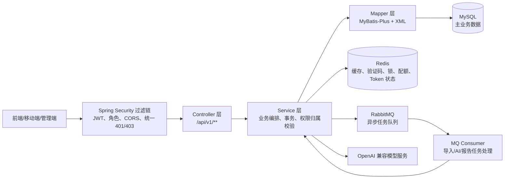

系统架构与技术栈对应关系：

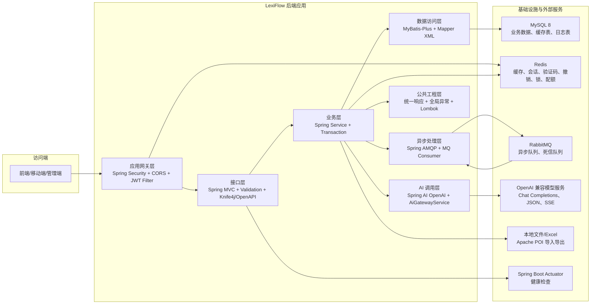

| 系统架构节点 | 对应技术栈 | 主要职责 | 关联功能 |
| --- | --- | --- | --- |
| 访问端 | 浏览器/前端应用、HTTP、Cookie、Bearer Token | 调用 REST API、携带 access token 和 refresh cookie | 用户端、管理端 |
| 应用网关层 | Spring Security、CORS、JJWT、Redis | 白名单放行、JWT 认证、管理员授权、401/403 统一响应、Token 撤销校验 | 登录态、后台权限、跨域访问 |
| 接口层 | Spring MVC、Jakarta Validation、Knife4j/OpenAPI | 路由映射、参数校验、接口文档、统一响应入口 | 全部 `/api/v1/**` 接口 |
| 业务层 | Spring Service、`@Transactional`、领域枚举 | 业务编排、事务控制、归属校验、状态流转 | 认证、词库、学习、复习、AI、报告、后台 |
| 数据访问层 | MyBatis-Plus、Mapper XML、分页插件、逻辑删除 | CRUD、分页、复杂 SQL、统计聚合 | 28 张主业务表 |
| 异步处理层 | Spring AMQP、RabbitMQ、`async_task` | 创建任务、投递消息、消费任务、失败进入死信队列 | 词库导入、AI 问答、完形、评阅、报告 |
| AI 调用层 | Spring AI OpenAI、AiGatewayService、提示词模板、AI 配额 | 解析公共/私有 AI 配置、调用模型、记录日志、支持 JSON/流式输出 | 单词问答、完形、评阅、学习报告 |
| 缓存与状态基础设施 | Redis、Spring Data Redis | 验证码、登录限流、刷新会话、Token 黑名单、分布式锁、AI 配额、缓存命中缓冲 | 鉴权、AI 缓存、并发控制 |
| 主数据库 | MySQL 8、utf8mb4 | 业务数据持久化、AI 内容缓存、调用日志、报告数据 | 全部核心业务 |
| 文件处理 | Apache POI、本地文件路径 | Excel 模板、词库导入、错误报告 | 后台词库导入 |
| 运维探活 | Spring Boot Actuator | 健康检查 | 部署和运行诊断 |

原系统架构与技术栈对应关系（不细分版）：

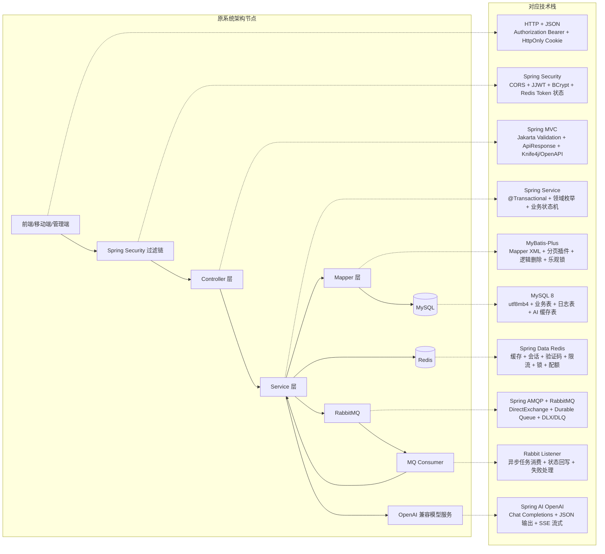

| 原系统架构节点 | 对应技术栈 | 说明 |
| --- | --- | --- |
| 前端/移动端/管理端 | HTTP、JSON、Bearer Token、HttpOnly Cookie | 调用后端 REST API，access token 走请求头，refresh token 走 Cookie |
| Spring Security 过滤链 | Spring Security、CORS、JJWT、BCrypt、Redis | 认证、授权、跨域、JWT 校验、Token 撤销状态和 refresh session |
| Controller 层 | Spring MVC、Jakarta Validation、Knife4j/OpenAPI、统一响应 | 路由映射、参数校验、接口文档、`ApiResponse` 包装 |
| Service 层 | Spring Service、`@Transactional`、领域枚举、业务状态机 | 业务编排、事务控制、资源归属校验、状态流转 |
| Mapper 层 | MyBatis-Plus、Mapper XML、分页插件、逻辑删除、乐观锁 | 数据库读写、复杂查询、分页和聚合统计 |
| MySQL | MySQL 8、utf8mb4 | 主业务数据、AI 内容缓存、异步任务、调用日志、报告数据 |
| Redis | Spring Data Redis、Redis | 验证码、登录限流、缓存、撤销 token、分布式锁、AI 配额和命中计数 |
| RabbitMQ | Spring AMQP、DirectExchange、Durable Queue、DLX/DLQ | 异步任务投递、削峰和失败隔离 |
| MQ Consumer | `@RabbitListener`、异步任务状态机 | 消费词库导入、AI 问答、完形、评阅、报告任务，并回写任务状态 |
| OpenAI 兼容模型服务 | Spring AI OpenAI、Chat Completions、JSON 输出、SSE 流式 | 提供 AI 单词问答、完形生成、完形评阅和学习报告 |

### 1.2 整体功能架构图

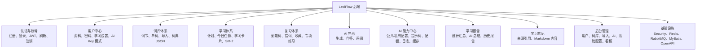

### 1.3 网关层：认证、权限、跨域

本项目没有独立 API Gateway。应用入口网关能力由 Spring Security 过滤器链承担，核心类为：

| 类 | 职责 |
| --- | --- |
| `SecurityConfig` | 配置安全过滤链、CORS、放行路径、管理员路径、统一 401/403 响应 |
| `JwtAuthenticationFilter` | 从请求中解析 Bearer Token，校验撤销状态和用户状态，写入 SecurityContext |
| `JwtTokenService` | 创建、解析、校验 access token 和 refresh token |
| `AuthContext` | 从 SecurityContext 获取当前登录用户 ID、角色等 |
| `AuthUser` | Spring Security `UserDetails` 实现，承载用户 ID、邮箱、角色、状态 |
| `CorsProperties` | 从 `lexiflow.cors` 读取跨域配置 |
| `AuthCookieProperties` | refresh token Cookie 名称、路径、SameSite、Secure 等配置 |

安全策略：

| 维度 | 实现 |
| --- | --- |
| 会话策略 | `SessionCreationPolicy.STATELESS`，服务端不创建 HTTP Session |
| CSRF | 禁用，使用 JWT 认证 |
| 表单登录、HTTP Basic、Logout | 禁用，由 `/api/v1/auth/**` 自定义处理 |
| Access Token | `Authorization: Bearer <token>` |
| Refresh Token | `refresh_token` HttpOnly Cookie |
| 管理员权限 | `/api/v1/admin/**` 需要 `ROLE_ADMIN` |
| 普通接口 | 除白名单外全部需要认证 |
| 未认证响应 | 统一返回 `ApiResponse.fail`，HTTP 401 |
| 无权限响应 | 统一返回 `ApiResponse.fail`，HTTP 403 |
| 用户资源归属 | 多数在 Service 层通过 `userId` 条件查询和业务校验保证 |

白名单接口：

| 路径 | 说明 |
| --- | --- |
| `/api/v1/ping` | 健康探测 |
| `/api/v1/auth/register` | 注册 |
| `/api/v1/auth/login` | 登录 |
| `/api/v1/auth/login-captcha` | 登录验证码 |
| `/api/v1/auth/refresh` | 刷新 access token |
| `/api/v1/wordbooks/**` | 公共词库和单词查询 |
| `/actuator/health` | 健康检查 |
| OpenAPI/Swagger/Knife4j 静态资源 | 接口文档访问 |

跨域配置：

| 配置 | 说明 |
| --- | --- |
| 配置前缀 | `lexiflow.cors` |
| local 默认 Origin | `http://localhost:5173`、`http://127.0.0.1:5173`、`http://localhost:4173`、`http://127.0.0.1:4173` |
| 支持凭证 | 允许携带 Cookie，用于 refresh token |
| 实现位置 | `SecurityConfig` 注入 `CorsConfigurationSource` |

### 1.4 整体技术架构

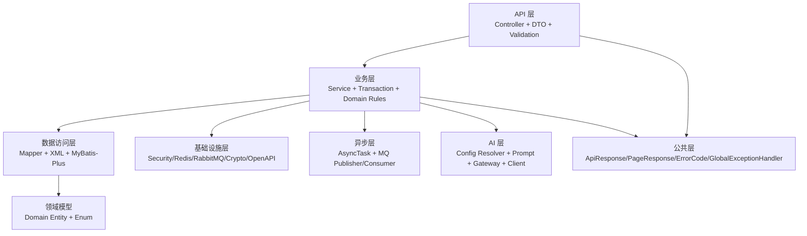

上图说明代码分层；下图按“功能架构 -> 后端技术栈 -> 基础设施”的角度展示各技术之间的关系。

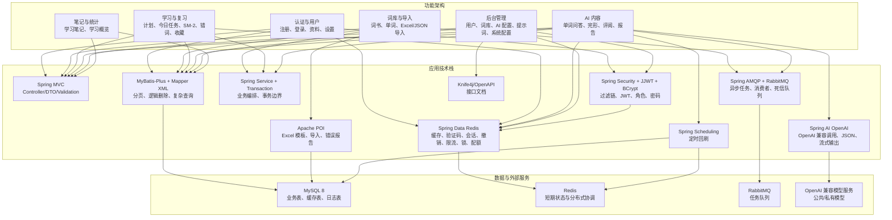

功能与技术栈对应关系：

| 功能架构 | 入口技术 | 核心业务技术 | 数据/状态技术 | 异步/外部技术 |
| --- | --- | --- | --- | --- |
| 认证与用户 | Spring MVC、Validation | Spring Security、JJWT、BCrypt、Service 事务 | MyBatis-Plus + MySQL、Redis | 无 |
| 词库浏览 | Spring MVC | Service 编排、MyBatis-Plus 分页 | MySQL、Mapper XML | 无 |
| 词库导入 | Spring MVC Multipart | Service 事务、Apache POI、JSON 解析 | MySQL 导入任务表、错误表、词表 | RabbitMQ 导入队列 |
| 学习计划与今日任务 | Spring MVC | Service 事务、SM-2 算法、状态流转 | MySQL 计划/任务/进度表、Redis 辅助状态 | 完成后触发 AI 完形预热 |
| 复习错词收藏 | Spring MVC | Service 归属校验、分页查询 | MySQL `user_word_state`、`wrong_word`、`favorite_word` | 无 |
| AI 单词问答 | Spring MVC、SSE | AI 网关、提示词模板、配额校验、缓存命中 | MySQL `word_ai_qa`、`ai_call_log`、Redis 锁/缓存/配额 | RabbitMQ、Spring AI OpenAI |
| AI 完形与评阅 | Spring MVC、SSE | AI 网关、提示词模板、题目校验、作答判分 | MySQL `cloze_*`、`study_event`、`wrong_word`、Redis 锁 | RabbitMQ、Spring AI OpenAI |
| AI 学习报告 | Spring MVC | 学习数据聚合、AI JSON 生成、Markdown 落库 | MySQL `study_report`、学习事件和任务表 | RabbitMQ、Spring AI OpenAI |
| 后台管理 | Spring MVC | Spring Security 管理员授权、Service CRUD | MySQL、Redis 缓存失效 | OpenAPI/Knife4j 辅助联调 |
| 笔记与统计 | Spring MVC | Service 归属校验、统计聚合 | MySQL 笔记表、学习事件表 | 无 |

典型请求链路：

1. `Controller` 接收 HTTP 请求，完成参数绑定和 `@Valid` 校验。
2. `AuthContext` 读取当前用户，或由 SecurityConfig 判断管理员权限。
3. `Service` 完成业务编排、事务控制、资源归属校验、状态流转。
4. `Mapper` 使用 MyBatis-Plus 或 XML 查询 MySQL。
5. 需要缓存、锁、配额、Token 状态时访问 Redis。
6. 需要耗时处理时创建 `async_task` 并投递 RabbitMQ。
7. 需要 AI 输出时经 `AiGatewayService` 解析配置、检查配额、调用模型、记录日志。
8. `GlobalExceptionHandler` 将异常转换为统一响应结构。

### 1.5 核心业务流程总览

| 流程 | 主入口 | 核心服务 | 主要数据 |
| --- | --- | --- | --- |
| 注册登录 | `/api/v1/auth/register`、`/login` | `AuthService`、`UserService`、`JwtTokenService` | `users`、Redis token/session/captcha |
| 刷新与注销 | `/api/v1/auth/refresh`、`/logout` | `AuthService`、`RefreshTokenSessionService`、`JwtRevocationService` | Redis refresh session、revoked jti |
| 词库浏览 | `/api/v1/wordbooks/**` | `WordbookService` | `wordbook`、`word`、外部词典库 |
| 后台词库维护 | `/api/v1/admin/wordbooks/**` | `AdminWordbookService` | `wordbook`、`word` |
| 词库导入 | `/api/v1/admin/wordbooks/{id}/imports` | `WordImportService`、RabbitMQ Consumer | `word_import_task`、`word_import_error`、`word` |
| 学习计划 | `/api/v1/study/plans/**` | `StudyPlanService` | `study_plan` |
| 今日任务 | `/api/v1/study/tasks/today` | `DailyTaskService` | `daily_task`、`daily_task_item`、`user_word_state` |
| 学习反馈 | `/api/v1/study/task-items/{id}/feedback` | `DailyTaskService`、`SpacedRepetitionService` | `study_event`、`user_word_state`、`wrong_word` |
| 复习错词收藏 | `/api/v1/review/**` | `ReviewService` | `user_word_state`、`wrong_word`、`favorite_word` |
| 单词 AI 问答 | `/api/v1/ai/words/{wordId}/questions` | `WordAiContentService`、`AiGatewayService` | `word_ai_qa`、`ai_call_log`、`async_task` |
| AI 完形 | `/api/v1/ai/cloze-tasks`、`/api/v1/quizzes/cloze/**` | `ClozeQuizService`、`ClozeAttemptAiReviewService` | `cloze_*`、`study_event`、`wrong_word` |
| AI 学习报告 | `/api/v1/ai/report-tasks`、`/api/v1/reports/**` | `StudyReportService` | `study_report`、`daily_task`、`study_event` |
| 学习笔记 | `/api/v1/notes` | `StudyNoteService` | `study_note` |
| 后台 AI 管理 | `/api/v1/admin/ai/**` | `AiPublicConfigService`、`AiPromptTemplateService`、`AdminAiCallLogService` | `ai_public_config`、`ai_prompt_*`、`ai_call_log` |
| 系统配置 | `/api/v1/admin/system-configs` | `SystemConfigService` | `system_config` |

### 1.6 数据库数据模型总览

数据库脚本位于 `docs/sql/schema.sql`，物理外键被有意省略，关系由应用逻辑、唯一索引和普通索引约束。

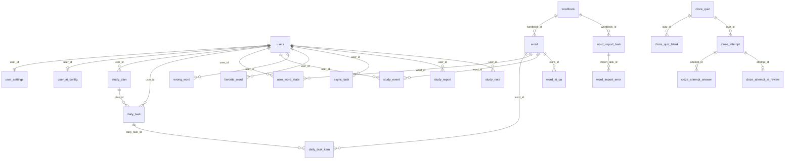

数据域分组：

| 数据域 | 表 |
| --- | --- |
| 用户认证 | `users`、`user_settings`、`user_ai_config` |
| 词库 | `wordbook`、`word`、`word_import_task`、`word_import_error` |
| 学习计划与任务 | `study_plan`、`daily_task`、`daily_task_item` |
| 学习进度 | `user_word_state`、`study_event`、`wrong_word`、`favorite_word` |
| 学习笔记 | `study_note` |
| AI 配置与提示词 | `ai_public_config`、`ai_prompt_template`、`ai_prompt_feature_binding` |
| AI 内容与日志 | `word_ai_qa`、`ai_call_log`、`async_task` |
| 完形测验 | `cloze_quiz`、`cloze_quiz_blank`、`cloze_attempt`、`cloze_attempt_answer`、`cloze_attempt_ai_review` |
| 学习报告 | `study_report` |
| 系统配置 | `system_config` |

## 第 2 层：模块拆分与调用关系

### 2.1 包结构总览

| 包 | 模块 | 职责 |
| --- | --- | --- |
| `com.lexiflow.auth` | 认证模块 | 注册、登录、JWT、刷新 Token、注销、验证码、登录限流、用户认证缓存 |
| `com.lexiflow.user` | 用户模块 | 用户资料、密码、学习偏好、AI Key 模式 |
| `com.lexiflow.wordbook` | 词库模块 | 公共词书、单词查询、词典 JSON 解析 |
| `com.lexiflow.wordbook.importing` | 词库导入模块 | Excel/JSON URL 导入、导入任务、错误报告 |
| `com.lexiflow.admin` | 后台模块 | 后台用户管理、看板、AI 调用日志 |
| `com.lexiflow.admin.wordbook` | 后台词库模块 | 后台词书与单词 CRUD、启停 |
| `com.lexiflow.study` | 学习计划模块 | 学习计划创建、主计划查询、暂停、恢复、结束 |
| `com.lexiflow.study.task` | 今日任务模块 | 今日任务生成、卡片、学习反馈、错词专项练习 |
| `com.lexiflow.study.progress` | 学习进度模块 | SM-2 间隔重复、掌握状态、学习事件、错词、收藏 |
| `com.lexiflow.study.statistics` | 学习统计模块 | 用户学习总览统计 |
| `com.lexiflow.review` | 复习模块 | 到期复习词、错词列表、错词解决、收藏词 |
| `com.lexiflow.quiz.cloze` | 完形模块 | AI 完形生成、题目读取、作答、AI 评阅 |
| `com.lexiflow.ai.config` | AI 配置模块 | 公共 AI 配置、用户私有 AI 配置 |
| `com.lexiflow.ai.prompt` | AI 提示词模块 | 提示词模板、默认模板、功能绑定、输出 Schema |
| `com.lexiflow.ai.core` | AI 核心模块 | 配置解析、配额、统一网关、Spring AI 客户端、命中刷新 |
| `com.lexiflow.ai.content` | AI 单词内容模块 | 单词问答同步/异步/流式、结果缓存 |
| `com.lexiflow.async` | 异步任务模块 | 通用异步任务状态表和状态查询 |
| `com.lexiflow.report` | 学习报告模块 | 报告任务、AI 报告生成、报告查询 |
| `com.lexiflow.note` | 笔记模块 | 学习笔记 CRUD |
| `com.lexiflow.system.config` | 系统配置模块 | 后台系统配置 CRUD |
| `com.lexiflow.infra` | 基础设施模块 | Security、MyBatis、Redis、RabbitMQ、加密、配置属性 |
| `com.lexiflow.common` | 公共模块 | 统一响应、分页响应、错误码、异常处理、Ping |

### 2.2 模块与接口映射

| 模块 | Controller | 主要接口 |
| --- | --- | --- |
| 健康探测 | `PingController` | `GET /api/v1/ping` |
| 认证 | `AuthController` | `POST /api/v1/auth/register`、`POST /login`、`GET /login-captcha`、`POST /refresh`、`POST /logout`、`GET /me` |
| 用户 | `UserController` | `GET/PUT /api/v1/users/me/profile`、`PUT /password`、`GET/PUT /settings` |
| 用户 AI 配置 | `UserAiConfigController` | `GET/PUT /api/v1/users/me/ai-config` |
| 词库 | `WordbookController` | `GET /api/v1/wordbooks`、`GET /{wordbookId}`、`GET /words`、`GET /words/lookup` |
| 学习计划 | `StudyPlanController` | `POST /api/v1/study/plans`、`GET /primary`、`PUT /{planId}`、`POST /pause|resume|end` |
| 今日任务 | `DailyTaskController` | `GET /api/v1/study/tasks/today`、`GET /tasks/{taskId}`、`POST /tasks/today/wrong-word-practice`、`GET /task-items/{itemId}/card`、`POST /task-items/{itemId}/feedback` |
| 学习统计 | `StudyStatisticsController` | `GET /api/v1/study/statistics/overview` |
| 复习 | `ReviewController` | `GET /api/v1/review/due-words`、`wrong-words`、`POST /wrong-words/{id}/resolve`、收藏词增删查 |
| 单词 AI 问答 | `WordAiContentController` | `POST /api/v1/ai/words/{wordId}/questions`、`question-tasks`、`GET questions/state`、`POST questions/stream` |
| 完形 | `ClozeQuizController` | `POST /api/v1/ai/cloze-tasks`、`GET /api/v1/quizzes/cloze/{quizId}`、作答、评阅任务、流式评阅 |
| 报告 | `StudyReportController` | `POST /api/v1/ai/report-tasks`、`GET /api/v1/reports/{reportId}`、`GET /api/v1/reports` |
| 异步任务 | `AsyncTaskController` | `GET /api/v1/tasks/{taskId}` |
| 笔记 | `StudyNoteController` | `GET/POST /api/v1/notes`、`GET/PUT/DELETE /api/v1/notes/{noteId}` |
| 后台用户 | `AdminUserController` | 后台用户分页、详情、禁用、启用 |
| 后台看板 | `AdminDashboardController` | `GET /api/v1/admin/dashboard/overview` |
| 后台词库 | `AdminWordbookController` | 后台词书 CRUD、启停、单词 CRUD、启停、删除 |
| 后台导入 | `AdminWordImportController` | 模板下载、Excel 导入、JSON URL 导入、导入任务、错误报告 |
| 后台 AI 配置 | `AdminAiConfigController` | 公共 AI 配置列表、新增、更新、激活、启用、禁用 |
| 后台提示词 | `AdminAiPromptController` | 提示词模板列表、新增、更新、复制、删除、功能绑定 |
| 后台 AI 日志 | `AdminAiCallLogController` | AI 调用日志分页 |
| 后台系统配置 | `AdminSystemConfigController` | 系统配置 CRUD |

### 2.3 模块依赖关系

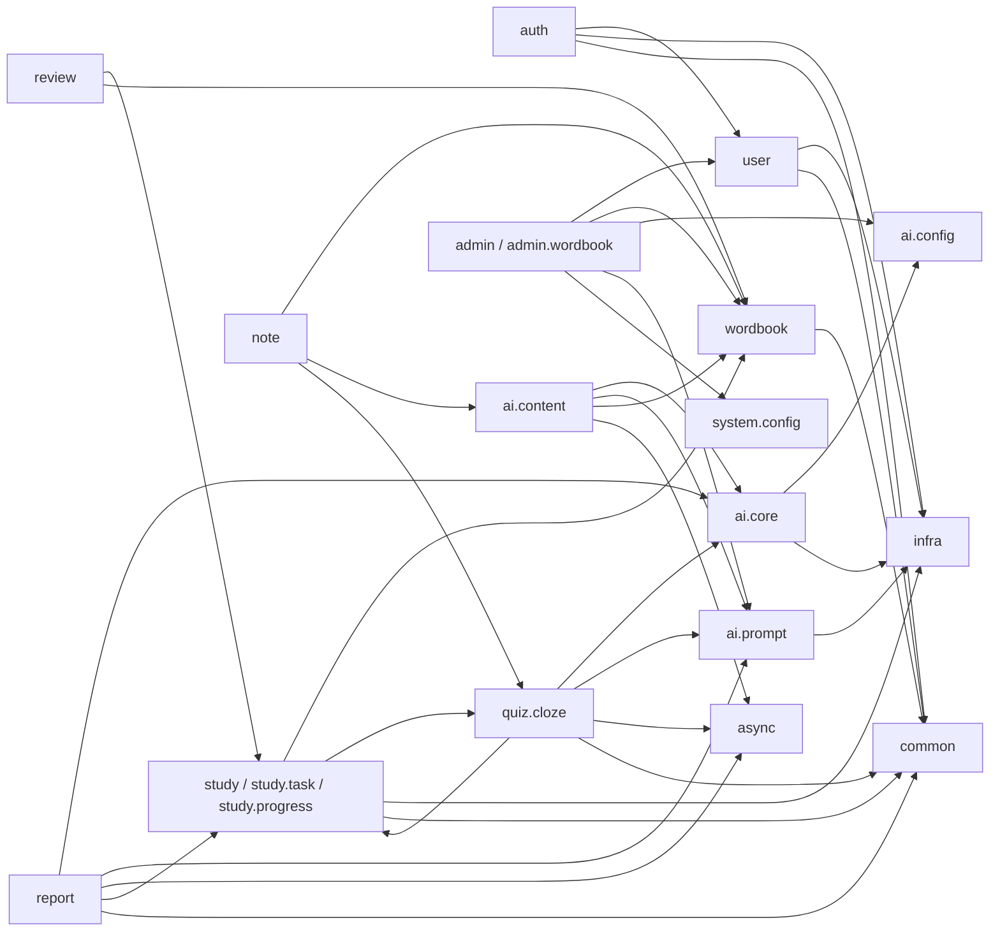

### 2.4 RabbitMQ 异步队列

| 任务 | Exchange | Queue | DLX/DLQ | 消费者 |
| --- | --- | --- | --- | --- |
| 词库导入 | `lexiflow.word-import.exchange` | `lexiflow.word-import.queue` | 有 | `WordImportTaskConsumer` |
| AI 完形生成 | `lexiflow.cloze-generation.exchange` | `lexiflow.cloze-generation.queue` | 有 | `ClozeGenerationTaskConsumer` |
| AI 单词问答 | `lexiflow.word-qa.exchange` | `lexiflow.word-qa.queue` | 有 | `WordQaTaskConsumer` |
| AI 完形评阅 | `lexiflow.cloze-review.exchange` | `lexiflow.cloze-review.queue` | 有 | `ClozeReviewTaskConsumer` |
| AI 学习报告 | `lexiflow.study-report.exchange` | `lexiflow.study-report.queue` | 有 | `StudyReportTaskConsumer` |

所有队列采用 DirectExchange + durable Queue，并配置死信交换机和死信队列。

### 2.5 Redis 责任边界

| 场景 | 相关类 | 说明 |
| --- | --- | --- |
| 登录验证码 | `LoginCaptchaService` | 验证码签发与校验 |
| 登录限流 | `AuthRateLimitService` | 登录失败次数、验证码要求、短时封禁 |
| JWT 撤销 | `JwtRevocationService` | 记录已注销或失效的 token jti |
| Refresh Session | `RefreshTokenSessionService` | 保存 refresh token 会话状态 |
| Token Version | `TokenVersionService` | 校验用户 token_version，支持全量失效旧 token |
| 用户认证缓存 | `AuthUserCacheService` | 缓存 `AuthUser` 快照 |
| 用户设置缓存 | `UserSettingsCacheService` | 缓存用户学习设置 |
| AI JSON 缓存 | `RedisJsonCacheService` | 公共配置等短期缓存 |
| AI 配置变更广播 | `RedisCacheInvalidationPublisher`、`RedisCacheInvalidationSubscriber` | 多实例下清理本地缓存 |
| 分布式锁 | `RedisDistributedLockService` | AI 内容生成防重复 |
| AI 公共配额 | `RedisAiQuotaCounter` | 公共模型每日调用额度 |
| AI 命中计数缓冲 | `RedisAiHitCountBuffer` | 缓存命中次数先写 Redis，再定时回刷 DB |

## 第 3 层：类、方法与数据模型

### 3.1 认证模块

| 类 | 主要方法 | 说明 |
| --- | --- | --- |
| `AuthController` | `register`、`login`、`loginCaptcha`、`refresh`、`logout`、`me` | HTTP 入口，负责 Cookie 设置和当前用户响应 |
| `AuthService` | `register`、`login`、`refresh`、`logout`、`currentUser` | 认证业务编排 |
| `JwtTokenService` | `createAccessToken`、`createRefreshToken`、`parseAccessToken`、`parseRefreshToken`、`accessTokenTtlSeconds`、`refreshTokenTtlSeconds` | JWT 创建、解析、TTL |
| `JwtAuthenticationFilter` | `doFilterInternal` | 请求级 JWT 认证过滤 |
| `AuthRateLimitService` | `assertLoginAllowed`、`requiresCaptcha`、`recordLoginFailure`、`clearLoginFailures` | 登录失败限流与验证码要求 |
| `LoginCaptchaService` | `issue`、`assertValid` | 登录验证码签发与校验 |
| `RefreshTokenSessionService` | `store`、`getStatus`、`delete` | refresh token 服务端状态 |
| `JwtRevocationService` | `revokeAccessToken`、`revokeRefreshToken`、`isAccessTokenRevoked`、`isRefreshTokenRevoked` | token jti 黑名单 |
| `TokenVersionService` | `currentVersion`、`isCurrent`、`bumpVersion` | 用户级 token 版本控制 |
| `AuthUserCacheService` | `get`、`put`、`evict` | 用户认证快照缓存 |

认证相关数据模型：

| 模型 | 表/存储 | 关键字段 |
| --- | --- | --- |
| `User` | `users` | `email`、`password_hash`、`role`、`status`、`token_version` |
| `AuthUser` | Redis 缓存 + SecurityContext | `userId`、`email`、`role`、`status` |
| Access Token | JWT | `jti`、`sub=userId`、`ver=tokenVersion`、过期时间 |
| Refresh Token | JWT + Redis Session + Cookie | `jti`、`sub=userId`、`type=refresh`、`ver=tokenVersion` |

### 3.2 用户模块

| 类 | 主要方法 | 说明 |
| --- | --- | --- |
| `UserController` | `getProfile`、`updateProfile`、`changePassword`、`getSettings`、`updateSettings` | 当前用户资料、密码、设置入口 |
| `UserService` | `createUser`、`findByEmail`、`getById`、`getActiveUserById`、`updateLoginInfo`、`updateProfile`、`changePassword`、`getOrCreateSettings`、`updateSettings` | 用户账号与学习设置业务 |
| `UserSettingsCacheService` | `get`、`put`、`evict` | 用户设置缓存 |
| `UserMapper` | MyBatis-Plus BaseMapper | `users` 数据访问 |
| `UserSettingsMapper` | MyBatis-Plus BaseMapper | `user_settings` 数据访问 |

用户数据模型：

| 模型 | 表 | 说明 |
| --- | --- | --- |
| `User` | `users` | 用户账号、密码哈希、角色、状态、token 版本、登录信息 |
| `UserSettings` | `user_settings` | 目标考试、每日新词数、AI Key 模式、日报入口、时区 |
| `AiKeyMode` | 枚举 | `PUBLIC`、`PRIVATE` |
| `UserRole` | 枚举 | `USER`、`ADMIN` |
| `UserStatus` | 枚举 | `ACTIVE`、`DISABLED`、`LOCKED` |

### 3.3 词库模块

| 类 | 主要方法 | 说明 |
| --- | --- | --- |
| `WordbookController` | `listWordbooks`、`getWordbook`、`pageWords`、`lookupWord` | 公共词库查询入口 |
| `WordbookService` | `listWordbooks`、`getWordbook`、`pageWords`、`lookupWord`、`getEnabledWordbook` | 词库列表、单词分页、查词 |
| `WordDictionaryJsonService` | `normalizeWord`、`normalizeRequiredJson`、`normalizeOptionalJson`、`deriveSummary`、`buildTransJson`、`buildSentencesJson`、`toJson` | 词典 JSON 标准化、主释义提取 |
| `WordbookMapper` | BaseMapper | `wordbook` 数据访问 |
| `WordMapper` | BaseMapper + XML | 词库单词分页、抽词、外部词典查询 |

词库数据模型：

| 模型 | 表 | 关键字段 |
| --- | --- | --- |
| `Wordbook` | `wordbook` | `name`、`code`、`type`、`difficulty_level`、`word_count`、`enabled`、`sort_order` |
| `Word` | `word` | `wordbook_id`、`word`、`normalized_word`、音标、释义 JSON、例句 JSON、`sequence_no`、`enabled` |
| `WordbookType` | 枚举 | `CET4`、`CET6`、`POSTGRADUATE` 等词库类型 |
| `LexiflowDictionaryEntryRow` | 外部词典查询 DTO | `WordMapper.xml` 查询外部库 `lexiflow_dict.dictionary_entry` |

### 3.4 后台词库与导入模块

| 类 | 主要方法 | 说明 |
| --- | --- | --- |
| `AdminWordbookController` | 词书 CRUD、启停、单词 CRUD、启停、删除 | 后台词库维护 HTTP 入口 |
| `AdminWordbookService` | `pageWordbooks`、`getWordbook`、`createWordbook`、`updateWordbook`、`enableWordbook`、`disableWordbook`、`pageWords`、`createWord`、`updateWord`、`removeWord`、`enableWord`、`disableWord` | 后台词书与单词维护 |
| `AdminWordImportController` | 模板、导入、任务、错误、错误报告接口 | 后台导入 HTTP 入口 |
| `WordImportService` | `buildTemplate`、`importWords`、`importWordsFromJsonUrl`、`processImportTask`、`getTask`、`pageTasks`、`pageErrors`、`buildErrorReport` | Excel/JSON URL 导入编排 |
| `WordImportTaskPublisher` | 发布导入任务 | RabbitMQ Producer |
| `WordImportTaskConsumer` | 消费导入任务 | RabbitMQ Consumer |

导入数据模型：

| 模型 | 表 | 说明 |
| --- | --- | --- |
| `WordImportTask` | `word_import_task` | 导入来源、重复策略、状态、统计、文件路径/URL |
| `WordImportError` | `word_import_error` | 行号、单词、错误编码、错误信息、原始数据 |
| `WordImportDuplicateStrategy` | 枚举 | `SKIP`、`OVERWRITE`、`FILL_EMPTY` |
| `WordImportSourceType` | 枚举 | `EXCEL`、`JSON_URL` |
| `WordImportStatus` | 枚举 | `PENDING`、`RUNNING`、`SUCCESS`、`PARTIAL_SUCCESS`、`FAILED` |

### 3.5 学习计划模块

| 类 | 主要方法 | 说明 |
| --- | --- | --- |
| `StudyPlanController` | `createPlan`、`getPrimaryPlan`、`updatePlan`、`pausePlan`、`resumePlan`、`endPlan` | 学习计划 HTTP 入口 |
| `StudyPlanService` | `createPlan`、`getPrimaryPlan`、`getPrimaryActivePlanEntity`、`updatePlan`、`pausePlan`、`resumePlan`、`endPlan` | 学习计划生命周期管理 |
| `StudyPlanMapper` | BaseMapper | `study_plan` 数据访问 |

学习计划数据模型：

| 模型 | 表 | 关键字段 |
| --- | --- | --- |
| `StudyPlan` | `study_plan` | `user_id`、`wordbook_id`、`new_words_per_group`、`review_words_per_group`、`status`、`current_sequence_no`、`is_primary`、`version` |
| `StudyPlanStatus` | 枚举 | `ACTIVE`、`PAUSED`、`COMPLETED`、`ENDED` |

主要规则：

1. 创建主计划时，旧主计划会被结束或让位，保证用户主学习计划唯一。
2. 计划必须绑定启用的词库。
3. 更新计划会影响后续未完成任务的组大小和复习/新词分配。
4. `current_sequence_no` 记录当前学习到的词库顺序，是新词推进的关键游标。

### 3.6 今日任务与学习进度模块

| 类 | 主要方法 | 说明 |
| --- | --- | --- |
| `DailyTaskController` | `getTodayTask`、`getTask`、`createWrongWordPractice`、`getCard`、`submitFeedback` | 今日任务、卡片、反馈入口 |
| `DailyTaskService` | `getTodayTask`、`getTask`、`getCard`、`createWrongWordPractice`、`submitFeedback` | 任务生成、任务读取、学习反馈 |
| `WordChoiceQuestionService` | `buildQuestion` | 为单词卡片构造选择题 |
| `SpacedRepetitionService` | `applyFeedback`、`qualityScore` | SM-2 间隔重复计算 |
| `DailyTaskMapper` | BaseMapper | `daily_task` 数据访问 |
| `DailyTaskItemMapper` | BaseMapper | `daily_task_item` 数据访问 |
| `UserWordStateMapper` | BaseMapper | `user_word_state` 数据访问 |
| `StudyEventMapper` | BaseMapper + XML | 学习事件聚合统计 |
| `WrongWordMapper` | BaseMapper | `wrong_word` 数据访问 |
| `FavoriteWordMapper` | BaseMapper | `favorite_word` 数据访问 |

任务与进度数据模型：

| 模型 | 表 | 关键字段 |
| --- | --- | --- |
| `DailyTask` | `daily_task` | `task_date`、`group_no`、`task_type`、`status`、`new_count`、`review_count`、`done_count` |
| `DailyTaskItem` | `daily_task_item` | `daily_task_id`、`word_id`、`item_type`、`status`、`feedback`、`done_at` |
| `UserWordState` | `user_word_state` | `mastery_status`、`learned`、`repetition`、`interval_days`、`easiness_factor`、`next_review_date` |
| `StudyEvent` | `study_event` | `scene`、`feedback`、`quality_score`、`is_correct`、`duration_seconds`、`source_ref_id` |
| `WrongWord` | `wrong_word` | `wrong_count`、`last_source`、`last_event_id`、`resolved` |
| `FavoriteWord` | `favorite_word` | 用户收藏词 |
| `StudyFeedback` | 枚举 | `UNKNOWN`、`KNOWN` |
| `DailyTaskType` | 枚举 | `DAILY`、`WRONG_WORD_PRACTICE` |
| `DailyTaskItemType` | 枚举 | `NEW`、`REVIEW`、`EXTRA` |
| `MasteryStatus` | 枚举 | `NEW`、`LEARNING`、`REVIEWING`、`MASTERED`、`DIFFICULT` |
| `StudyScene` | 枚举 | `NEW`、`REVIEW`、`EXTRA`、`QUIZ` |

### 3.7 复习模块

| 类 | 主要方法 | 说明 |
| --- | --- | --- |
| `ReviewController` | `pageDueWords`、`pageWrongWords`、`resolveWrongWord`、`pageFavoriteWords`、`favoriteWord`、`deleteFavoriteWord` | 复习、错词、收藏 HTTP 入口 |
| `ReviewService` | `pageDueWords`、`pageWrongWords`、`resolveWrongWord`、`pageFavoriteWords`、`favoriteWord`、`deleteFavoriteWord` | 到期词查询、错词解决、收藏维护 |

复习模块主要复用 `user_word_state`、`wrong_word`、`favorite_word`、`word`、`wordbook`。到期词以 `next_review_date <= today` 和用户/词库维度查询。

### 3.8 AI 核心、配置与提示词模块

| 类 | 主要方法 | 说明 |
| --- | --- | --- |
| `AiGatewayService` | `generateJson`、`generateJsonStream` | AI 调用统一入口，负责配额、调用、日志 |
| `AiConfigResolver` | 解析运行时配置 | 根据用户 `ai_key_mode` 选择公共配置或私有配置 |
| `AiQuotaService` | `checkQuota` | 公共 AI 配额校验 |
| `SpringAiChatClient` | 同步/流式 Chat Completions | 基于 Spring AI OpenAI 兼容接口 |
| `AiHitCountFlushService` | `flushBufferedHits` | 定时刷新 AI 缓存命中次数 |
| `AiPublicConfigService` | `listConfigs`、`createConfig`、`updateConfig`、`activateConfig`、`enableConfig`、`disableConfig` | 后台公共 AI 配置管理 |
| `UserAiConfigService` | `getConfig`、`saveConfig` | 用户私有 AI 配置管理 |
| `AiPromptTemplateService` | `listGroups`、`resolve`、`createTemplate`、`updateTemplate`、`copyTemplate`、`copyBuiltin`、`deleteTemplate`、`bindFeature`、`onCacheInvalidation` | 提示词模板解析和后台管理 |
| `AiPromptOutputSchemaService` | `defaultSchema`、`defaultSchemaJson`、`resolveSchemaJson`、`normalizeAndValidate`、`buildOutputFormatPrompt`、`schemaNode` | AI 输出 JSON Schema 管理 |
| `ApiKeyCryptoService` | `encrypt`、`decrypt` | AI Key AES 加密与解密 |

AI 数据模型：

| 模型 | 表 | 关键字段 |
| --- | --- | --- |
| `AiPublicConfig` | `ai_public_config` | `api_base_url`、`encrypted_api_key`、`model_name`、`daily_quota_per_user`、`active`、`enabled` |
| `UserAiConfig` | `user_ai_config` | `user_id`、`api_base_url`、`encrypted_api_key`、`model_name`、`stream_enabled` |
| `AiPromptTemplate` | `ai_prompt_template` | `feature_type`、`wordbook_id`、`system_prompt`、`instruction_prompt`、`output_schema_json` |
| `AiPromptFeatureBinding` | `ai_prompt_feature_binding` | 功能类型与当前模板绑定 |
| `AiCallLog` | `ai_call_log` | `content_type`、`config_scope`、`model_name`、token 用量、耗时、状态 |
| `AiConfigScope` | 枚举 | `PUBLIC`、`PRIVATE` |
| `AiContentType` | 枚举 | `WORD_QA`、`CLOZE`、`CLOZE_REVIEW`、`REPORT` |
| `AiPromptFeatureType` | 枚举 | `WORD_QA`、`CLOZE_QUIZ`、`CLOZE_REVIEW` 等 |

AI 配置解析规则：

1. 读取用户设置 `user_settings.ai_key_mode`。
2. `PRIVATE` 模式读取 `user_ai_config`，解密 API Key 后调用。
3. `PUBLIC` 模式读取当前激活且启用的 `ai_public_config`。
4. 公共配置有本地短缓存和 Redis 缓存，并通过 Redis 发布订阅做变更失效。
5. 公共模式会走 `AiQuotaService` 做每日配额限制，私有模式不消耗公共配额。
6. 每次调用都写入 `ai_call_log`，失败也记录错误摘要。

### 3.9 AI 单词问答模块

| 类 | 主要方法 | 说明 |
| --- | --- | --- |
| `WordAiContentController` | `generateWordQuestion`、`createWordQuestionTask`、`getWordQuestionState`、`streamWordQuestion` | 单词 AI 问答同步、异步、状态、流式接口 |
| `WordAiContentService` | `generateWordQuestion`、`getWordQuestionState`、`createWordQuestionTask`、`processWordQaTask`、`streamWordQuestion` | 单词 AI 问答业务 |
| `WordQaTaskPublisher` | 发布 AI 单词问答任务 | RabbitMQ Producer |
| `WordQaTaskConsumer` | 消费 AI 单词问答任务 | RabbitMQ Consumer |
| `WordAiQaMapper` | BaseMapper | `word_ai_qa` 数据访问 |

数据模型：

| 模型 | 表 | 说明 |
| --- | --- | --- |
| `WordAiQa` | `word_ai_qa` | 单词、问题、输入 hash、缓存 key、AI JSON 内容、命中次数 |
| `AsyncTask` | `async_task` | 异步任务状态，`task_type=AI_WORD_QA` |
| `WordQaTaskMessage` | RabbitMQ 消息 | 携带异步任务 ID |

缓存与并发策略：

1. 按单词、词库、问题、提示词、输出 Schema 等生成 `source_hash` 和 `cache_key`。
2. 先查 `word_ai_qa.cache_active=1` 的 DB 缓存。
3. 未命中时使用 Redis 分布式锁，避免同一内容并发重复生成。
4. 命中缓存时先缓存在 Redis 命中计数缓冲区，由定时任务回刷 DB。
5. 支持同步返回、异步任务、SSE 流式返回三种调用方式。

### 3.10 AI 完形模块

| 类 | 主要方法 | 说明 |
| --- | --- | --- |
| `ClozeQuizController` | `createClozeTask`、`getQuiz`、`submitAttempt`、`getAttempt`、`getReview`、`createReviewTask`、`streamReview` | 完形生成、读取、作答、评阅入口 |
| `ClozeQuizService` | `createClozeTask`、`prefetchCompletedGroupCloze`、`processClozeTask`、`getQuiz`、`submitAttempt`、`getAttempt` | 完形题目生成、预热、作答判分 |
| `ClozeAttemptAiReviewService` | `getReview`、`createReviewTask`、`processReviewTask`、`streamReview` | AI 作答评阅 |
| `ClozeBlankWordSelector` | 选择目标单词 | 根据来源类型挑选完形目标词 |
| `ClozeGenerationTaskPublisher` / `Consumer` | 完形生成异步队列 | RabbitMQ |
| `ClozeReviewTaskPublisher` / `Consumer` | 完形评阅异步队列 | RabbitMQ |

完形数据模型：

| 模型 | 表 | 关键字段 |
| --- | --- | --- |
| `ClozeQuiz` | `cloze_quiz` | `user_id`、`wordbook_id`、`daily_task_id`、`source_type`、`source_hash`、`cache_key`、`passage`、`candidate_words`、`target_word_ids` |
| `ClozeQuizBlank` | `cloze_quiz_blank` | `quiz_id`、`blank_no`、`word_id`、`answer_word`、`explanation` |
| `ClozeAttempt` | `cloze_attempt` | `quiz_id`、`user_id`、`total_blanks`、`correct_count`、`wrong_count`、`score` |
| `ClozeAttemptAnswer` | `cloze_attempt_answer` | `attempt_id`、`blank_id`、`user_answer`、`correct_answer`、`correct` |
| `ClozeAttemptAiReview` | `cloze_attempt_ai_review` | `attempt_id`、`source_hash`、`content_json`、`status`、`model_name` |
| `ClozeSourceType` | 枚举 | `TODAY_NEW`、`WRONG_WORDS`、`MIXED`、`COMPLETED_GROUP` |
| `ClozeAttemptAiReviewStatus` | 枚举 | `RUNNING`、`DONE`、`FAILED` |

完形来源：

| 来源 | 说明 |
| --- | --- |
| `COMPLETED_GROUP` | 今日任务完成后预热生成，用本组已完成单词 |
| `TODAY_NEW` | 今日新词 |
| `WRONG_WORDS` | 错词 |
| `MIXED` | 混合来源 |

### 3.11 异步任务模块

| 类 | 主要方法 | 说明 |
| --- | --- | --- |
| `AsyncTaskController` | `getTask` | 用户查询异步任务状态 |
| `AsyncTaskService` | `createTask`、`markRunning`、`markRunningIfPending`、`markSuccess`、`markFailed`、`markPendingFailed`、`getOwnedTaskEntity`、`getTaskEntity`、`listRecentTasks`、`getTask` | 通用异步任务状态管理 |
| `AsyncTaskMapper` | BaseMapper | `async_task` 数据访问 |

异步任务状态：

| 模型 | 表 | 说明 |
| --- | --- | --- |
| `AsyncTask` | `async_task` | 发起用户、任务类型、状态、进度、结果 ID、错误信息 |
| `AsyncTaskType` | 枚举 | `AI_WORD_QA`、`AI_CLOZE`、`AI_CLOZE_REVIEW`、`AI_REPORT` |
| `AsyncTaskStatus` | 枚举 | `PENDING`、`RUNNING`、`SUCCESS`、`FAILED` |

### 3.12 学习报告模块

| 类 | 主要方法 | 说明 |
| --- | --- | --- |
| `StudyReportController` | `createReportTask`、`getReport`、`pageReports` | AI 报告任务和报告查询入口 |
| `StudyReportService` | `createReportTask`、`processReportTask`、`getReport`、`pageReports` | 学习数据汇总、AI 报告生成、报告查询 |
| `StudyReportTaskPublisher` / `Consumer` | 报告生成异步队列 | RabbitMQ |
| `StudyReportMapper` | BaseMapper | `study_report` 数据访问 |

报告数据模型：

| 模型 | 表 | 关键字段 |
| --- | --- | --- |
| `StudyReport` | `study_report` | `user_id`、`plan_id`、`wordbook_id`、`daily_task_id`、`report_date`、新词数、复习数、测验正确率、错词 ID、AI 总结 JSON、Markdown |
| `CreateReportTaskRequest` | DTO | 触发报告生成的请求参数 |
| `StudyReportResponse` | DTO | 报告展示数据 |

报告生成会聚合 `daily_task`、`study_event`、`wrong_word`、`cloze_attempt` 等数据，再经 `AiGatewayService` 生成结构化总结和 Markdown 内容。

### 3.13 学习笔记模块

| 类 | 主要方法 | 说明 |
| --- | --- | --- |
| `StudyNoteController` | `pageNotes`、`getNote`、`createNote`、`updateNote`、`deleteNote` | 笔记 CRUD HTTP 入口 |
| `StudyNoteService` | `pageNotes`、`getNote`、`createNote`、`updateNote`、`deleteNote` | 笔记业务和归属校验 |
| `StudyNoteMapper` | BaseMapper | `study_note` 数据访问 |

笔记数据模型：

| 模型 | 表 | 关键字段 |
| --- | --- | --- |
| `StudyNote` | `study_note` | `source_type`、`source_id`、`wordbook_id`、`word_id`、`title`、`quoted_text`、`content_md` |
| `StudyNoteSourceType` | 枚举 | 支持从 AI 单词问答、完形评阅等来源创建引用 |

### 3.14 后台与系统配置模块

| 类 | 主要方法 | 说明 |
| --- | --- | --- |
| `AdminUserController` / `AdminUserService` | `pageUsers`、`getUser`、`disableUser`、`enableUser` | 后台用户管理 |
| `AdminDashboardController` / `AdminDashboardService` | `overview` | 后台总览数据 |
| `AdminAiCallLogController` / `AdminAiCallLogService` | `pageLogs` | AI 调用日志查询 |
| `AdminSystemConfigController` / `SystemConfigService` | `pageConfigs`、`getConfig`、`createConfig`、`updateConfig`、`deleteConfig` | 系统配置管理 |

后台数据模型：

| 模型 | 表 | 说明 |
| --- | --- | --- |
| `SystemConfig` | `system_config` | 配置键、配置值、值类型、是否可编辑 |
| `SystemConfigValueType` | 枚举 | `STRING`、`NUMBER`、`BOOLEAN`、`JSON` |
| `AiCallLog` | `ai_call_log` | AI 调用审计、配额兜底、后台日志查询 |
| `AdminOverviewResponse` | DTO | 用户数、词库数、学习与 AI 概览 |

### 3.15 公共与基础设施模块

| 类 | 说明 |
| --- | --- |
| `ApiResponse` | 统一响应体 |
| `PageResponse` | 统一分页响应 |
| `ErrorCode` | 业务错误码枚举 |
| `BizException` | 业务异常 |
| `GlobalExceptionHandler` | 全局异常转换 |
| `ServletUtils` | 请求上下文工具 |
| `MybatisPlusConfig` | 分页插件配置 |
| `MybatisMetaObjectHandler` | 创建时间、更新时间、逻辑删除等填充 |
| `SecurityConfig` | 安全过滤链 |
| `RabbitMqConfig`、`RabbitMqNames` | RabbitMQ 交换机、队列、死信队列 |
| `ApiKeyCryptoService` | AI Key 加密 |
| `RedisKeys` | Redis key 命名集中管理 |

## 第 4 层：复杂流程与实现细节

### 4.1 登录、JWT 与鉴权流程

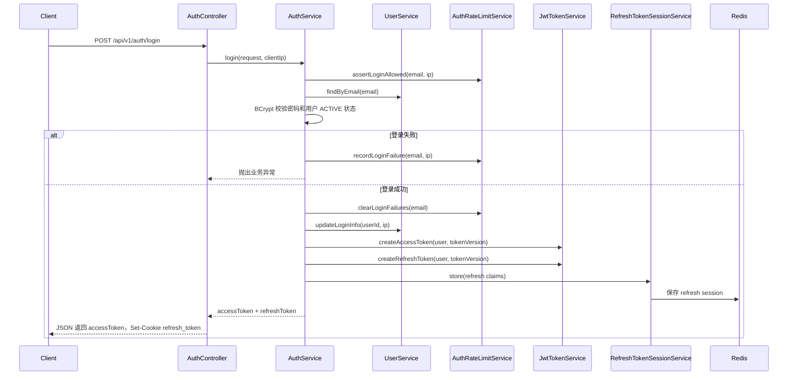

请求鉴权流程：

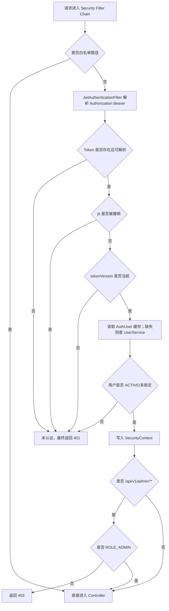

### 4.2 今日任务生成流程

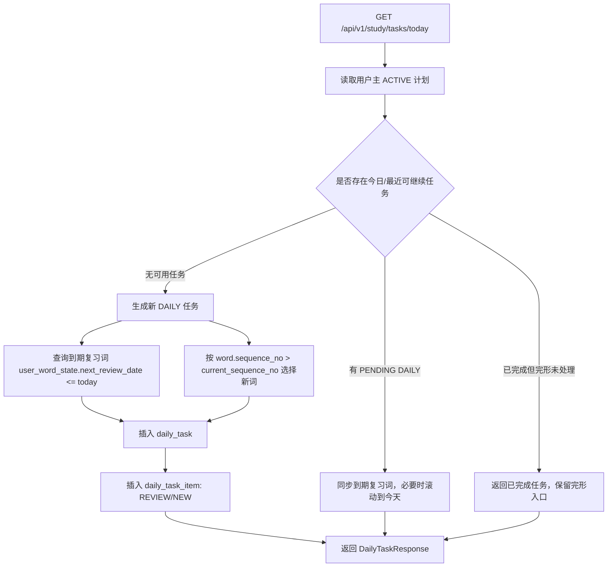

关键规则：

1. 今日任务依赖用户主计划，未创建计划时无法生成每日学习任务。
2. 复习词优先来自 `user_word_state.next_review_date <= today`。
3. 新词按 `word.sequence_no` 推进，使用 `study_plan.current_sequence_no` 作为游标。
4. 任务明细有唯一约束，避免同一任务内重复插入同一单词和类型。
5. 错词专项练习使用 `DailyTaskType.WRONG_WORD_PRACTICE`，不会像普通 DAILY 一样推进新词游标。

### 4.3 卡片反馈与 SM-2 流程

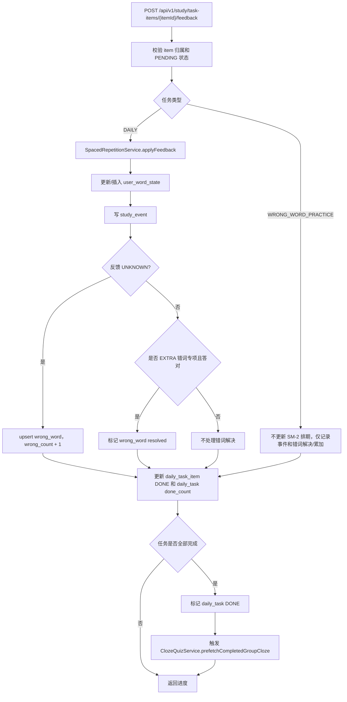

SM-2 简化规则：

| 用户反馈 | 质量分 | repetition | interval | mastery_status |
| --- | --- | --- | --- | --- |
| `UNKNOWN` | 2 | 归零 | 1 天 | 错误次数达到阈值为 `DIFFICULT`，否则 `LEARNING` |
| `KNOWN` 第 1 次 | 4 | +1 | 1 天 | `REVIEWING` |
| `KNOWN` 第 2 次 | 4 | +1 | 3 天 | `REVIEWING` |
| `KNOWN` 第 3 次及以后 | 4 | +1 | `previousInterval * easinessFactor` | `MASTERED` |

`easiness_factor` 按 SM-2 思路调整，最低为 1.30。

### 4.4 AI 单词问答同步、异步与流式流程

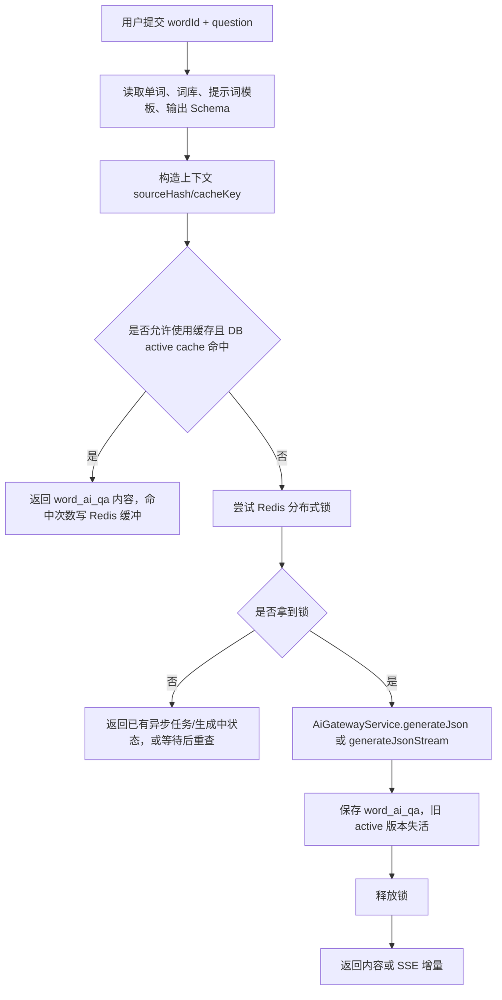

异步模式：

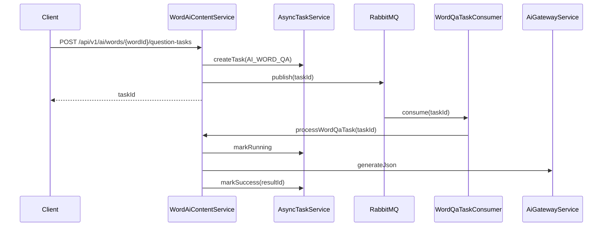

### 4.5 AI 完形生成流程

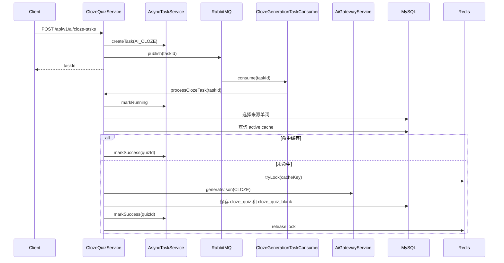

生成后校验要点：

1. AI 输出必须符合预期 JSON 结构。
2. 空格数量、候选词、目标词 ID、答案词需要与输入目标词匹配。
3. 同一 `cache_key` 仅保留一个 `cache_active=1` 的当前版本。
4. 并发相同题目时用 Redis 锁避免重复消耗 AI 配额。
5. 普通学习任务完成后会预热 `COMPLETED_GROUP` 完形题，降低用户进入完形页时的等待。

### 4.6 完形作答与 AI 评阅流程

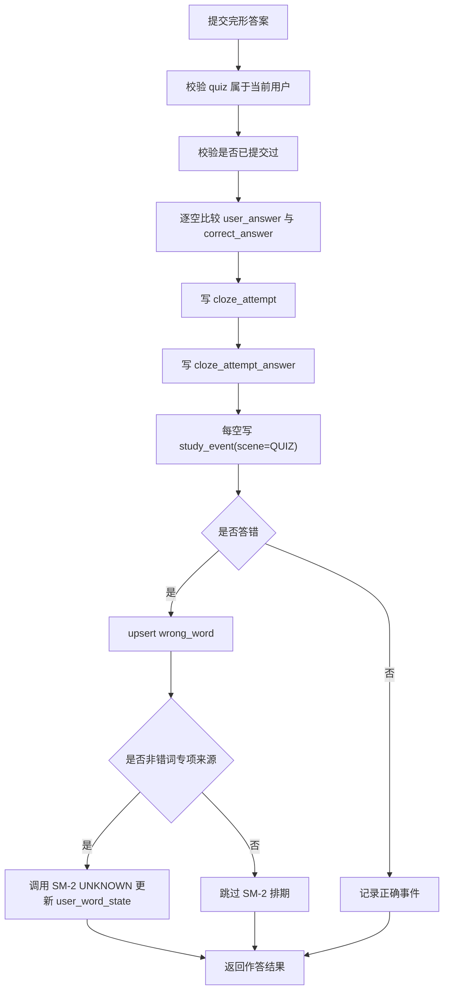

AI 评阅流程：

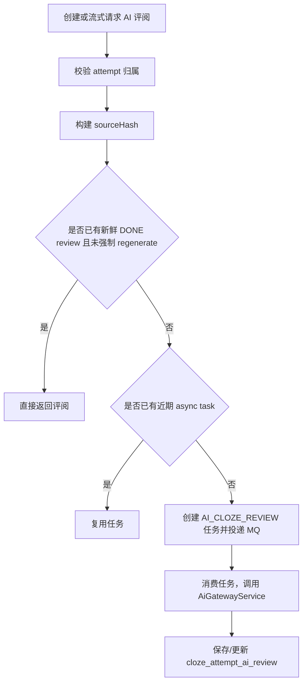

### 4.7 词库导入流程

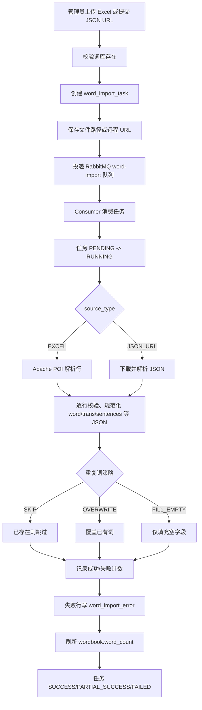

导入实现重点：

1. 中文 SQL 和导入内容需要保持 UTF-8/utf8mb4，避免注释或 JSON 内容乱码。
2. 行级错误不直接中断整个任务，除非发生不可恢复错误。
3. 错误报告由 `buildErrorReport` 生成 Excel。
4. 导入结束后同步刷新词书单词数冗余字段。

### 4.8 AI 学习报告生成流程

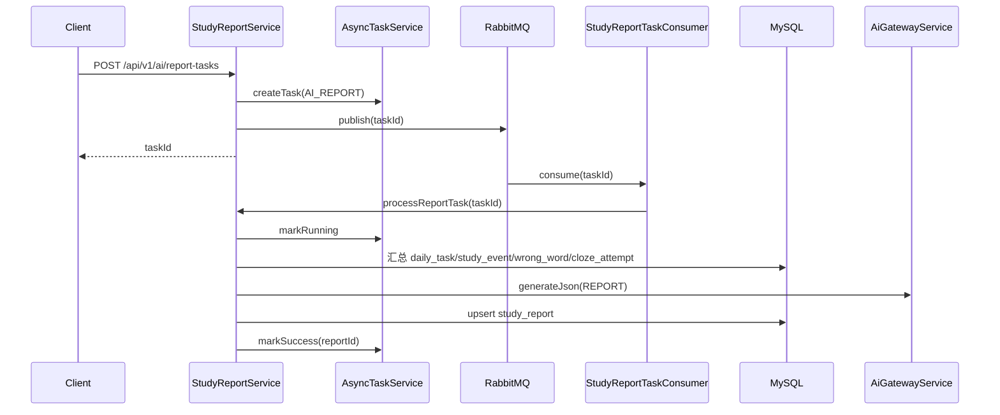

报告内容来源：

| 数据 | 来源 |
| --- | --- |
| 当日新词数、复习数 | `daily_task`、`daily_task_item` |
| 正误统计 | `study_event` |
| 高频错词 | `wrong_word` |
| 完形正确率 | `cloze_attempt` |
| AI 总结 | `AiGatewayService` 调用模型后得到的结构化 JSON |
| 展示内容 | `study_report.markdown_content` |

### 4.9 公共 AI 配额与调用日志流程

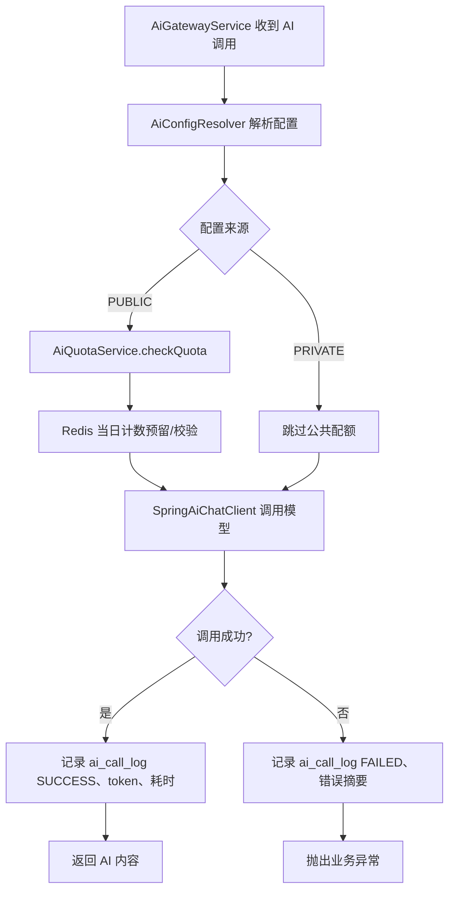

配额规则：

1. 仅公共配置消耗公共配额。
2. Redis 记录用户每日公共调用次数，日期维度按本地配置时区处理。
3. 初始化或兜底时可通过 `ai_call_log` 统计当日用量。
4. 后台可通过 `AdminAiCallLogService` 查询模型、类型、状态、用户维度的调用日志。

### 4.10 缓存失效与多实例一致性

AI 公共配置和提示词模板存在本地缓存与 Redis 缓存。后台变更配置或提示词时，Service 在事务提交后发布 Redis invalidation 消息，订阅者收到后清理本地缓存，避免多实例继续使用旧配置。

```mermaid
sequenceDiagram
    participant Admin as Admin API
    participant S as Config/Prompt Service
    participant DB as MySQL
    participant Pub as RedisCacheInvalidationPublisher
    participant Redis as Redis PubSub
    participant Sub as RedisCacheInvalidationSubscriber
    participant Local as Local Cache

    Admin->>S: 更新公共配置或提示词
    S->>DB: 写入变更
    S->>Pub: afterCommit 发布失效消息
    Pub->>Redis: publish
    Redis->>Sub: message
    Sub->>Local: evict cache
```

## 附录：主要数据表清单

| 表 | 说明 |
| --- | --- |
| `users` | 用户账号与基础资料 |
| `user_settings` | 用户学习偏好与 AI 使用偏好 |
| `user_ai_config` | 用户私有 AI 配置 |
| `wordbook` | 词库 |
| `word` | 词书内单词 |
| `word_import_task` | 词库导入任务 |
| `word_import_error` | 词库导入错误明细 |
| `study_plan` | 学习计划 |
| `daily_task` | 每日任务主表 |
| `daily_task_item` | 每日任务明细 |
| `user_word_state` | 用户单词掌握状态 |
| `study_event` | 学习事件 |
| `wrong_word` | 错词 |
| `favorite_word` | 收藏词 |
| `study_note` | 学习笔记 |
| `ai_public_config` | 管理员公共 AI 配置 |
| `ai_prompt_template` | AI 提示词模板 |
| `ai_prompt_feature_binding` | AI 功能提示词绑定 |
| `word_ai_qa` | AI 单词问答结果缓存 |
| `ai_call_log` | AI 调用日志 |
| `async_task` | 异步任务状态 |
| `cloze_quiz` | AI 完形题目主表 |
| `cloze_quiz_blank` | 完形空格 |
| `cloze_attempt` | 完形作答主表 |
| `cloze_attempt_answer` | 完形作答明细 |
| `cloze_attempt_ai_review` | 完形 AI 评阅 |
| `study_report` | AI 学习报告 |
| `system_config` | 系统配置 |

## 附录：后续维护建议

1. 新增业务模块时保持 `controller`、`service`、`domain`、`dto`、`mapper` 的分层一致性。
2. 新增用户私有资源接口时，优先在 Service 层使用 `userId` 条件查询并校验归属。
3. 新增 AI 功能时复用 `AiGatewayService`、`AiPromptTemplateService`、`AsyncTaskService` 和 RabbitMQ 的现有模式。
4. 新增耗时任务时先判断是否需要通用 `async_task` 状态查询、死信队列、任务复用和幂等处理。
5. 新增数据库表时保持 `created_at`、`updated_at`、`deleted`、必要索引和中文注释风格一致。
